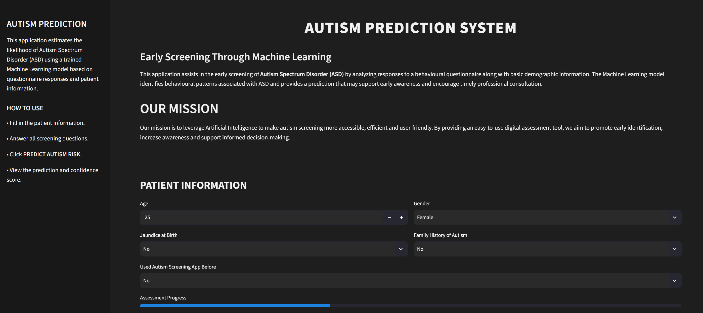
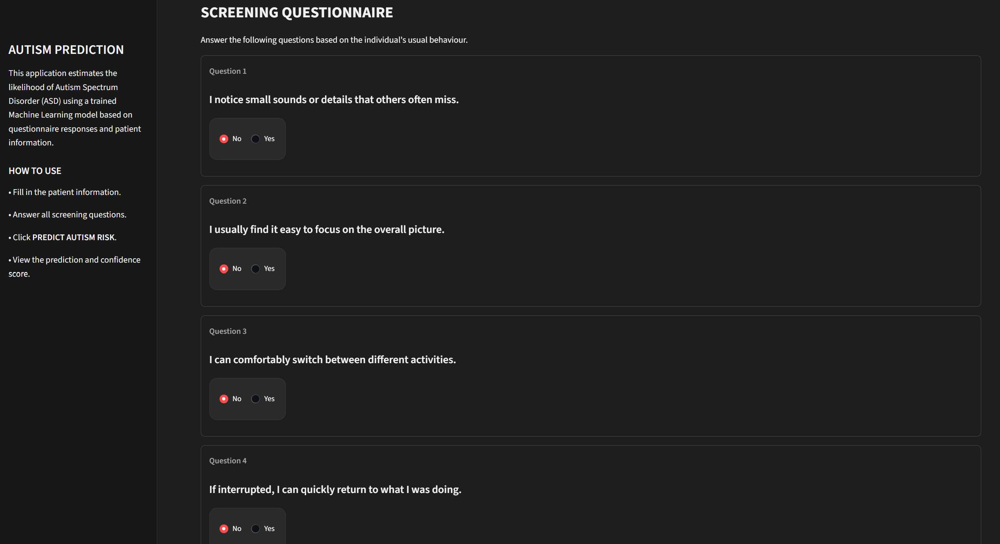
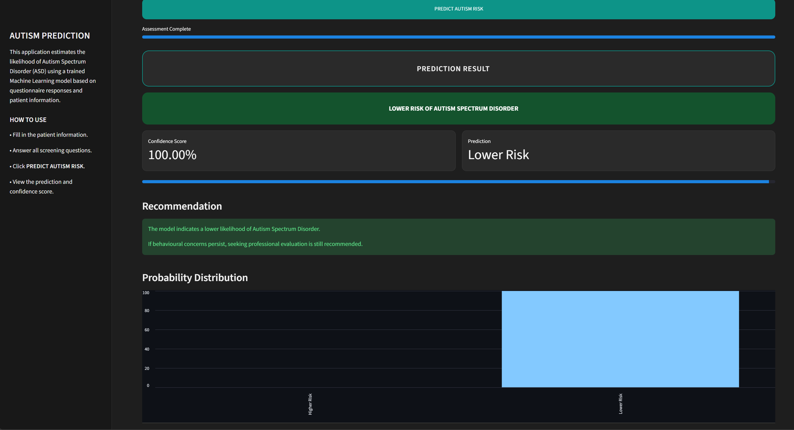

# 🩺 Autism Prediction System

<p align="center">


</p>

An interactive **Machine Learning-based web application** that estimates the likelihood of **Autism Spectrum Disorder (ASD)** using the AQ-10 screening questionnaire and patient information.

The application provides an intuitive interface for early autism screening, displaying prediction results, confidence scores, and recommendations.

---

# 🌐 Live Demo

### 🚀 Try the application here

**https://autism-prediction-ml-f4baywucl4kmehcn4aajh3.streamlit.app**

---

# 📖 Project Overview

Autism Spectrum Disorder (ASD) is a neurodevelopmental condition that affects communication, behaviour, and social interaction.

Early screening can help individuals receive timely professional evaluation and intervention.

This project leverages **Machine Learning** to analyse behavioural responses from the AQ-10 screening questionnaire along with patient information to estimate the likelihood of ASD.

The trained model is deployed using **Streamlit**, allowing users to perform a quick screening through a modern web interface.

---

# ✨ Features

- 🧠 Machine Learning based autism risk prediction
- 📋 AQ-10 behavioural screening questionnaire
- 👤 Patient demographic information
- 📊 Prediction confidence score
- 📈 Probability distribution chart
- 📄 Assessment summary
- 💡 Recommendation section
- 🌙 Modern dark-themed Streamlit interface
- 🌐 Live deployed application

---

# 🖼️ Application Screenshots

## 🏠 Home Page



---

## 📝 Screening Questionnaire



---

## 📊 Prediction Result



---

# 🛠️ Tech Stack

### Programming Language

- Python

### Machine Learning

- Scikit-learn
- Joblib

### Data Processing

- Pandas
- NumPy

### Web Framework

- Streamlit

### Visualization

- Streamlit Charts

---

# 📂 Project Structure

```text
Autism-Prediction-ML/
│
├── app.py
├── README.md
├── requirements.txt
├── .gitignore
│
├── data/
│   └── autism_screening.csv
│
├── images/
│   ├── images-home.png
│   ├── images-questionnaire.png
│   └── images-prediction.png
│
├── models/
│   └── autism_app_model.pkl
│
└── notebooks/
    ├── autism_prediction.ipynb
    └── deployment_model.ipynb
```

---

# 📊 Dataset

The model was trained on an Autism Screening dataset containing:

- AQ-10 questionnaire responses
- Age
- Gender
- Family history of autism
- Jaundice history
- Previous screening history

Target Variable:

- ASD Classification

---

# 🤖 Machine Learning Workflow

- Data Cleaning
- Exploratory Data Analysis (EDA)
- Feature Selection
- Data Preprocessing
- Model Training
- Model Evaluation
- Model Serialization using Joblib
- Streamlit Deployment

---

# 🚀 Installation

Clone the repository

```bash
git clone https://github.com/Tanishkahere/Autism-Prediction-ML.git
```

Move into the project directory

```bash
cd Autism-Prediction-ML
```

Install dependencies

```bash
pip install -r requirements.txt
```

Run the application

```bash
streamlit run app.py
```

---

# 🔮 Future Improvements

- PDF report generation
- User authentication
- Multi-language support
- Improved model performance with additional data
- Cloud database integration
- Doctor dashboard
- Mobile-friendly interface

---

# ⚠️ Disclaimer

This project is intended **only for educational purposes and preliminary autism screening.**

It **does not provide a medical diagnosis** and should not replace evaluation by qualified healthcare professionals.

---

# 👩‍💻 Author

**Tanishka Singh**

Electronics and Communication Engineering (AI)

Indira Gandhi Delhi Technical 

---

⭐ If you found this project interesting, consider giving the repository a **Star**.
